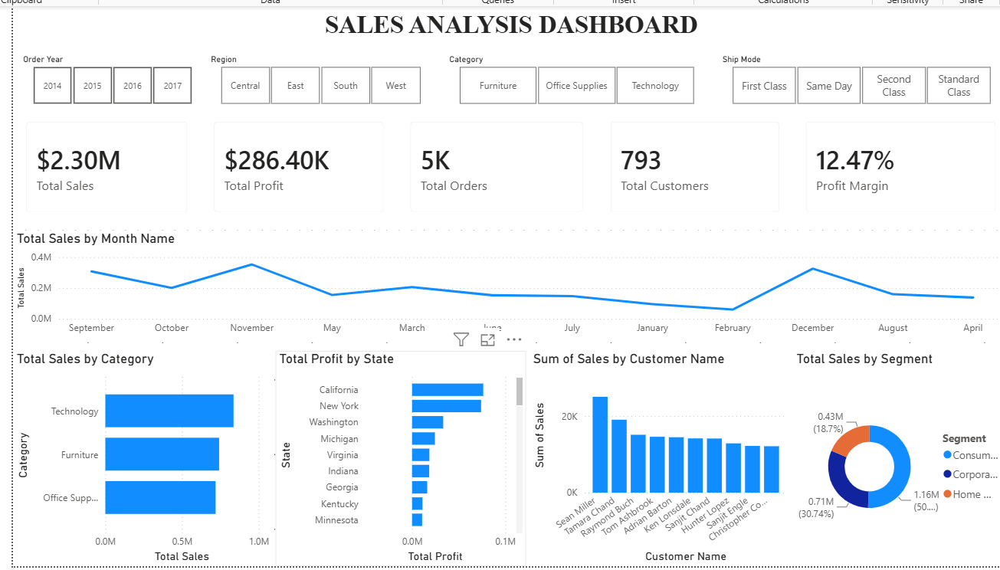
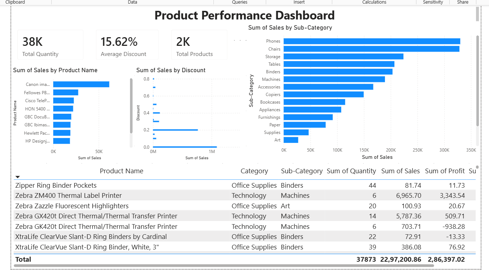
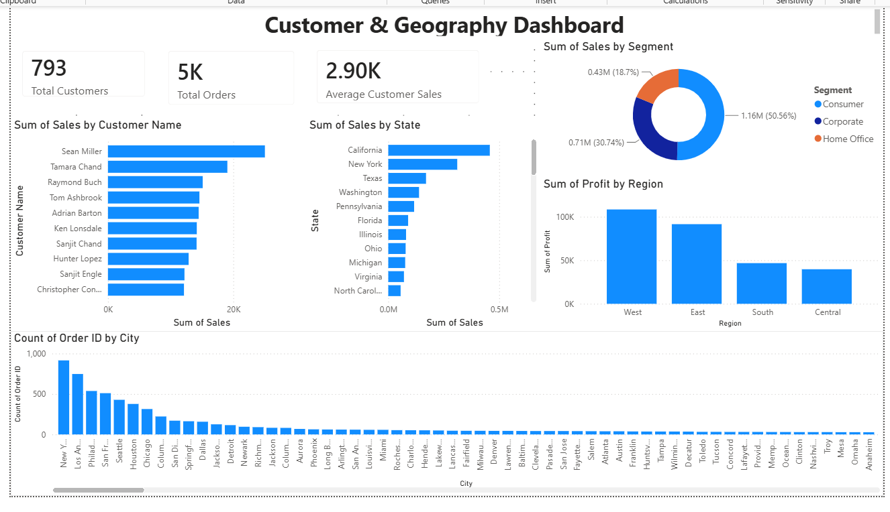

# Superstore Sales Analysis using Python, SQL Server & Power BI


---

##  Project Overview

This project presents an end-to-end retail sales analysis using the Superstore dataset. The workflow includes data cleaning, exploratory data analysis (EDA), SQL-based business queries, and an interactive Power BI dashboard.

The objective is to uncover sales trends, customer behavior, product performance, and regional profitability to support business decision-making.

---

##  Business Objectives

- Analyze overall sales and profit performance
- Identify top-performing products and categories
- Discover high-value customers
- Evaluate regional and state-wise performance
- Measure the impact of discounts on profitability
- Build an interactive dashboard for decision-makers

---

##  Tools & Technologies

- Python
- Pandas
- NumPy
- Matplotlib
- SQL Server
- Power BI
- Microsoft Excel
- Git & GitHub

---

## Project Structure

```text
Superstore-Sales-Analysis/
│
├── data/
├── notebooks/
├── sql/
├── powerbi/
├── images/
├── README.md
├── requirements.txt
└── LICENSE
```

---

##  Dashboard Pages

### Executive Dashboard



---

### Product Performance Dashboard



---

### Customer & Geography Dashboard



---

## Key Performance Indicators (KPIs)

- Total Sales
- Total Profit
- Total Orders
- Total Customers
- Average Sales
- Profit Margin

---

##  Exploratory Data Analysis

- Data Cleaning
- Missing Value Analysis
- Monthly Sales Trend
- Category Analysis
- Sub-Category Analysis
- Customer Analysis
- Region Analysis
- State Analysis
- Segment Analysis
- Discount vs Profit Analysis
- Correlation Analysis

---

##  Key Business Insights

- Technology generated the highest sales and profit.
- California was the highest-performing state.
- Texas generated high sales but negative profit.
- November recorded the highest monthly sales.
- Office Supplies had the highest order volume.
- Higher discounts generally reduced profitability.

---

##  Dataset

Sample Superstore Dataset (Orders Sheet)

Records: **9,994**

Columns: **21**

---

##  Future Improvements

- Sales Forecasting
- Customer Segmentation using Machine Learning
- Time Series Forecasting
- Automated Power BI Refresh
- Interactive Web Dashboard using Streamlit

---

##  Author

**Mahesh Chandra Nayak**

---

⭐ If you found this project useful, consider giving it a star!